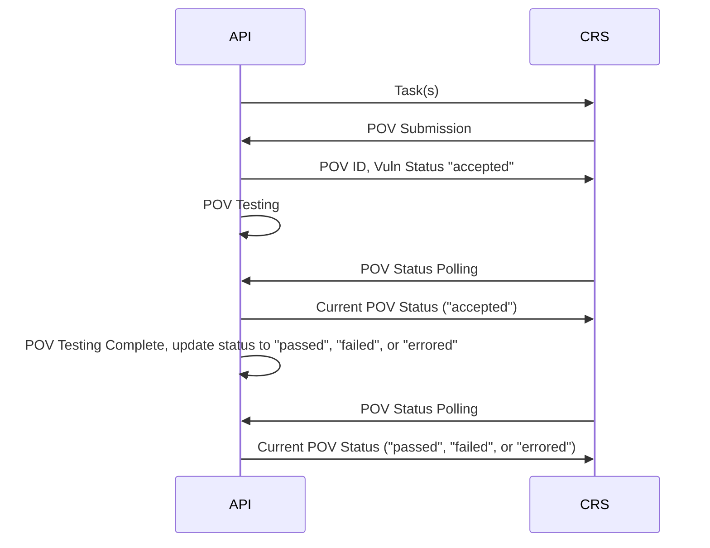
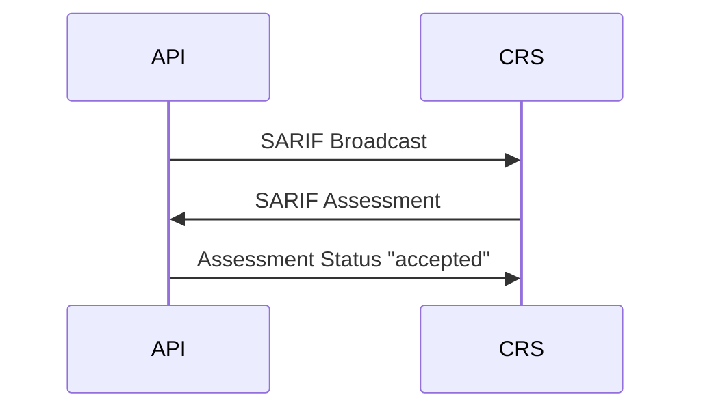
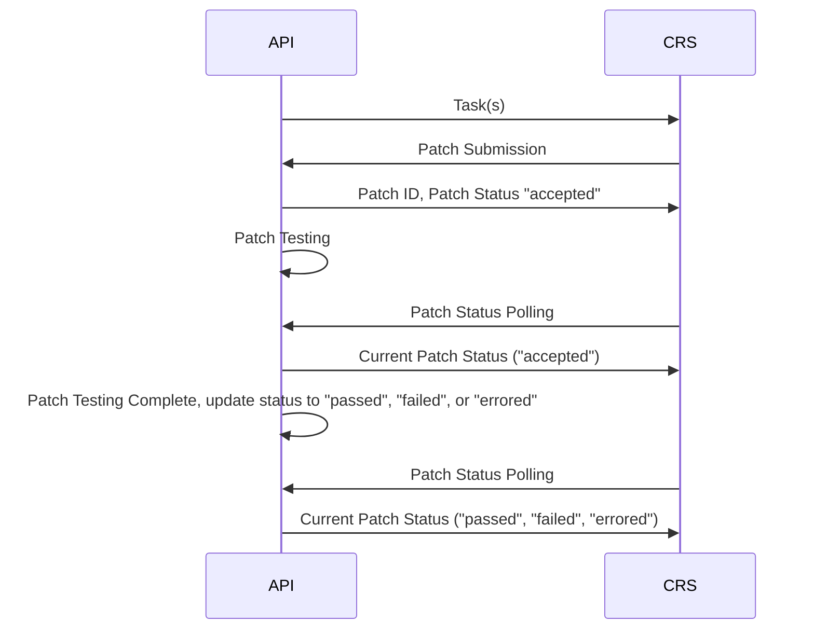
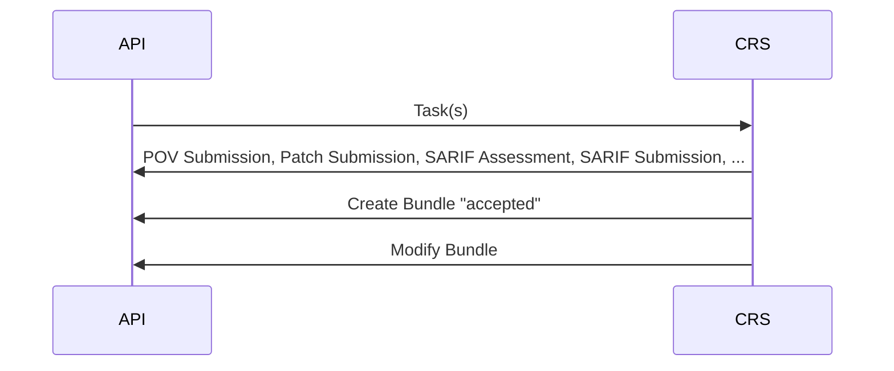
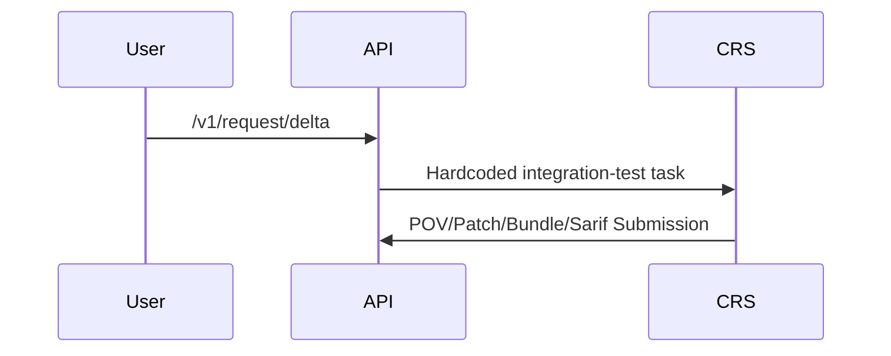
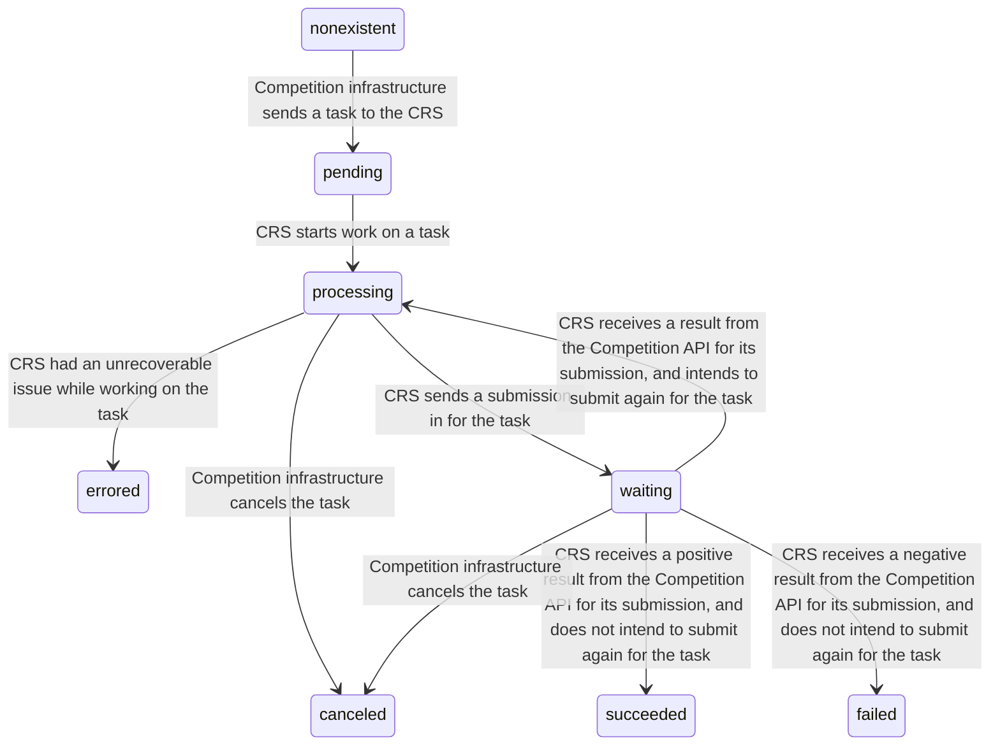

# API

See the [API Changelog](./CHANGELOG.md) for information on recent API changes.

- Competitors will consume the API described by `competition-swagger.yaml`
- Competitors will provide the API described by `crs-swagger.yaml`

NOTE: The JSON and YAML documents contain the same information and are generated from the same source.

## Competition API Interaction

During the competition, the Competition API sends tasks and SARIF broadcasts to CRSs and receives responses of several types (vulnerability, patch, or SARIF assessment). The Example Competition API checks interfaces
only. It does not send tasks, and it accepts any valid request.

The competition-time workflows for interacting with the Competition API are documented in the following charts.

### Submitting a vulnerability



### Submitting a SARIF assessment



### Submitting a patch



### Submitting a bundle



### Request Integration Test Task

After deploying your CRS, you now have the ability to task your CRS with a simple “[integration test](https://github.com/aixcc-finals/integration-test/tree/challenges/integration-test-delta-01)” challenge (delta scan) to
make sure your CRS and Telemetry are working as expected prior to the opening of the Round.

This endpoint is available from now until 5 minutes prior to the opening of a Round. It is accessible from the internet and from inside the tailnet. `duration_secs` is an optional parameter, and defaults to 4 hours.
Provide your Competition API credentials to kick off the task. This will send a task to the Round's expected CRS hostname (e.g. `team-moniker-exhibition2` for exhibition2) on the tailnet.



Here is an example curl you may use to trigger the integration testing task.

```bash
curl -u 11111111-1111-1111-1111-111111111111:pY8rLk7FvQ2hZm9GwUx3Ej5BnTcV4So0 -X 'POST' 'https://api.aixcc.tech/v1/request/delta/' -H 'Content-Type: application/json' -d '{"duration_secs": 3600 }'
```

## CRS API Task Statuses

The CRS API has a status endpoint which provides a summary of tasks by status, among other things. The statuses which tasks go through are documented in the state diagram below.



## Generating a Client or Server

It is possible to generate client or server code from the swagger documents. The documents are a best effort to provide a strongly typed schema but are not perfect. Use the generators at your own discretion as they are
not maintained by AIxCC and may not produce working code.

### OpenAPI Generator

OpenAPI generator is a fork and actively maintained continuation of the swagger-codegen project. The source code can be found here:
[https://github.com/openapitools/openapi-generator](https://github.com/openapitools/openapi-generator).

To run the generator using docker or podman:

```bash
docker run --rm -v $PWD:/local openapitools/openapi-generator-cli generate \
          -i /local/competition-swagger-v0.1.json \
          -g  lang \
          -o /local/out
```

- `-v $PWD:/local` mounts the current working directory into the `/local` directory in the container. A different host path could be provided for `$PWD`. All paths used in the following steps would be relative to the new
  path instead of `$PWD`.
- All arguments after `openapitools/openapi-generator-cli` are passed to the generator CLI inside the container
- `-i /local/competition-swagger-v0.1.json` is the path relative to the current working directory of the swagger file. On the host, `competition-swagger-v-0.1.json` is located in `$PWD`. If you want to change the file or
  path it must be a descendant of `$PWD`.
- `-g  lang` is used to specify the generator to run. If you pass an invalid value it will list all of the options.
- `-o /local/out` is the path relative to the current working directory to output the generated code.
- A language specific config file can be optionally provided using `-c /local/path_to_config`
  [Project Docs](https://github.com/OpenAPITools/openapi-generator/blob/b218e238f4f6cac8c919a78b296d3062bdfec0be/docs/customization.md#customizing-the-generator). The available config options can be found using the
  `config-help -g lang` subcommand instead of `generate`.

To see all available options for the generate command:

```bash
docker run --rm -v $PWD:/local openapitools/openapi-generator-cli help generate
```

### Viewing the UI

The swagger documents describe the CRS API and the Example Competition API. [Swagger](https://swagger.io/blog/api-strategy/difference-between-swagger-and-openapi/) is an ecosystem built around the
[OpenAPI](https://www.openapis.org/what-is-openapi) specification with which it is possible to render a UI documenting the API, to generate client code to interact with the API, and to generate server code to be the API.
In essence, the OpenAPI specification is a standard way of documenting HTTP APIs. This allows tools built to consume the description to be portable across APIs.

The different components can be used as needed for different applications. The Example Competition API specification is generated using inline code comments and served under the `/swagger/` path. A web framework specific
third-party dependency that included the swagger-ui was used to provide the endpoints.

The provided Example Competition API will serve the swagger UI at `/swagger/index.html`. The spec is served at `/swagger/doc.json` Competitors may find it useful to do something similar for their CRS.

Most webserver frameworks will have a package that can be used to help serve the UI. If this is not possible or you do not wish to use a third-party package, the source can be downloaded from
[https://github.com/swagger-api/swagger-ui/releases](https://github.com/swagger-api/swagger-ui/releases). After unpacking the archive using tar or ZIP, the precompiled source can be found in the `dist` directory.

If you do not wish to integrate the UI directly into the CRS system it is still possible to use for development.

- Using the same method described above, download and unpack the release.
- Place any number of swagger specs inside the `swagger-ui/dist` folder.
- Start a basic webserver from the `swagger-ui/dist` folder. For example the built-in Python 3 webserver:

```bash
# PWD: swagger-ui/dist
python -m http.server
```

- Change the path to the swagger file at the top of your page to the desired file. For example, `/competition-swagger-v0.1.json` if you placed a swagger spec called `competition-swagger-v0.1.json` at
  `swagger-ui/dist/competition-swagger-v0.1.json`.
- This will only allow viewing the documentation. Experimenting with the API endpoints requires a running API server serving the spec file. If the spec is served from the API server and it supports CORS, it is possible
  to specify the full URL to the spec in the box. This will allow you to experiment with the API using the `Try it Out` button.
