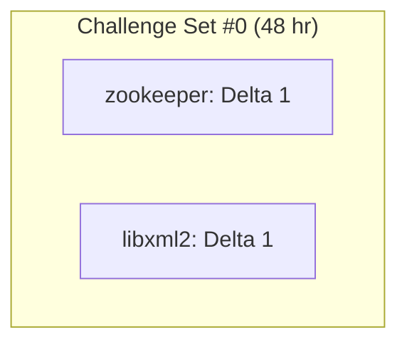

# Exhibition Round 1

2 Delta Challenges (1 C, 1 Java) with 48 hours in duration.

## Repositories

The following repositories were used during the Round:

- Libxml2 (C)
- Zookeeper (Java)

## Challenge Sequencing

Both Challenges were Delta challenges and sent similtaneously.

