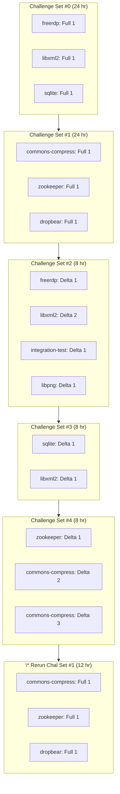

# Exhibition Round 2

9 Delta Challenges (6 C, 3 Java), 6 Full Scan Challenges (4 C, 2 Java).

## Repositories

The following repositories were used during the Round:

- Libxml2 (C)
- Libpng (C)
- AIxCC Integration Test (C)
- FreeRDP (C)
- Sqlite (C)
- Dropbear (C)
- Zookeeper (Java)
- Apache Commons Compress (Java)

## Challenge Tasks Archive

Download all challenge tasks that were sent during the Round: [exhibition2_challenge_tasks.tar.gz](./exhibition2_challenge_tasks.tar.gz).

Note: Times included in tasks.json are descriptive of when the Competition API generated the task,
and not the exact times of when the message was broadcast to each CRS (it should be close though!).

## Sequencing

## Notes

\* Challenge Set #1 was re-run during Exhibition Round 2 due to an upstream outage at OpenAI from 7:07pm ET on May 6th, 2025 to 3:15pm ET on May 8th, 2025.
As a result, CRS's using OpenAI were unable to make LLM API calls. The Organizers decided to re-run Challenge Set #1 as part of Exhibition 2 for 12 hours.
Challenge Set #0 had run successfully for ~5 hours before the outage. When access was restored, we reset budget amounts for all teams for Azure and LLMs and added a re-run of Challenge Set #1.
