# Exhibition Round 3

19 Delta Challenges (10 C, 9 Java), 8 Full Scan Challenges (5 C, 3 Java), 1 Unharnessed Delta Challenege (C), 2 Unharnessed Full Scan Challenges (1 C, 1 Java).

## Repositories

The following repositories were used during the Round:

- Libxml2 (C)
- Libpng (C)
- AIxCC Integration Test (C)
- FreeRDP (C)
- Sqlite (C)
- Dropbear (C)
- Curl (C)
- Libexif (C)
- Libpostal (C)
- s2n-tls
- Tika (Java)
- Zookeeper (Java)
- Apache Commons Compress (Java)
- IPF (Java)

## Challenge Tasks Archive

Download all challenge tasks that were sent during the Round: [exhibition3_challenge_tasks.tar.gz](./exhibition3_challenge_tasks.tar.gz). _See notes below_.

Note: Times included in tasks.json are descriptive of when the Competition API generated the task,
and not the exact times of when the message was broadcast to each CRS (it should be close though!).

## Sequencing

```mermaid
flowchart TD
  subgraph A["Challenge Set #1 (12 hr)"]
    direction LR
    A0["freerdp: Full 1"]
    B0["sqlite: Full 1"]
    C0["dropbear: Full 1"]
    D0["libpostal: Full 1"]
    E0["curl: Full 1"]

  end

  subgraph B["Challenge Set #2 (12 hr)"]
    direction LR
    A1["commons-compress: Full 1"]
    B1["zookeeper: Full 1"]
    C1["tika: Full 1"]
  end

  subgraph C["Challenge Set #3 (6 hr)"]
    direction LR
    A2["freerdp: Delta 1"]
    B2["integration-test: Delta 1"]
    C2["libpng: Delta 1"]
    F2["curl: Delta 1"]
    E2["libexif: Delta 1"]
  end

  subgraph D["Challenge Set #4 (6 hr)"]
    direction LR
    A3["sqlite: Delta 1"]
    B3["sqlite: Delta 2"]
    C3["sqlite: Delta 3"]
    D3["libxml2: Delta 1"]
    E3["libxml2: Delta 2"]
  end

  subgraph E["Challenge Set #5 (6 hr)"]
    direction LR
    A4["tika: Delta 1"]
    B4["tika: Delta 2"]
    C4["tika: Delta 3"]
    D4["tika: Delta 4"]
    E4["tika: Delta 5"]
  end

  subgraph F["Challenge Set #6 (6 hr)"]
    direction LR
    A5["zookeeper: Delta 1"]
    B5["zookeeper: Delta 2"]
    C5["commons-compress: Delta 2"]
    D5["commons-compress: Delta 3"]
  end

  subgraph G["Challenge Set #7 (12 hr)"]
    direction LR
    A6["ipf (Unharnessed): Full 1"]
    B6["s2n-tls (Unharnessed): Full 1"]
  end

  subgraph H["Challenge Set #8 (6 hr)"]
    direction LR
    A7["integration-test (Unharnessed): Delta 1"]
  end

  A --> B --> C --> D --> E --> F --> G --> H
```

## Notes

\* There were three challenges that, as sent to competitors, would have prevented meaningful POV and Patch submissions. These challenges were a part of the Tika challenge repository.
The challenges are:

- tk-delta-01 (task_id: `01974bc3-f9ed-73a2-9c76-bfe9d5311d3d`)
- tk-delta-03 (task_id: `01974bd4-0df0-7d96-aad6-4e3db89d190d`)
- tk-delta-05 (task_id: `01974bd4-10e9-784a-b6c7-2c5dc5151cf6`)

All of these challenges had diffs that would fail to apply.
For tk-delta-03 and tk-delta-05, they would fail to apply because of binary contents within the diff.
For tk-delta-01, the issue is related to inconsistent filenames in diff headers. We have fixed the root causes of the issues for these three challenges.
These Competition API fixes are now available via the new request/challenges endpoint and competitor-test-api.
