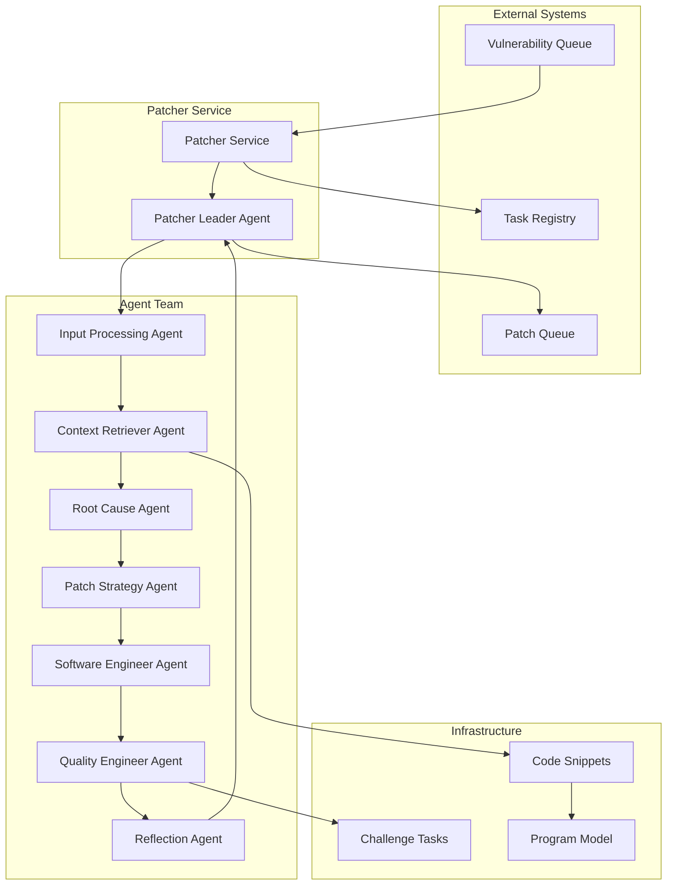
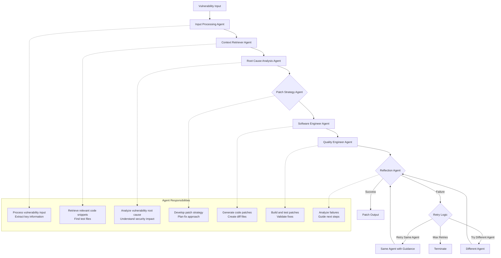
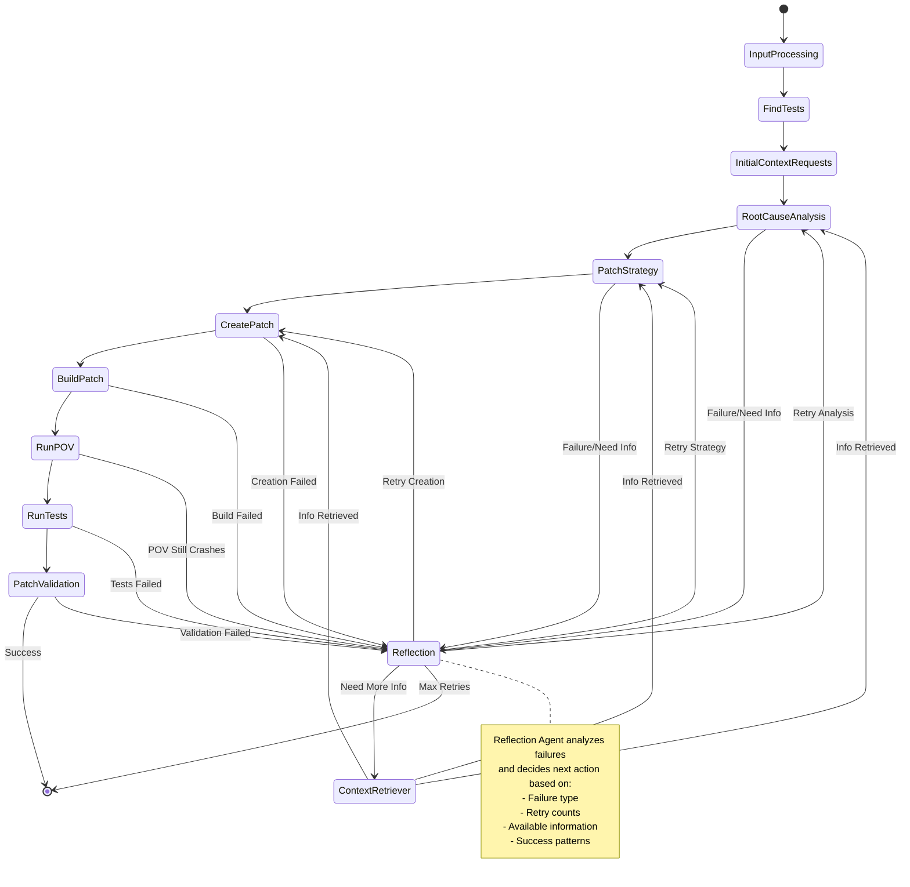
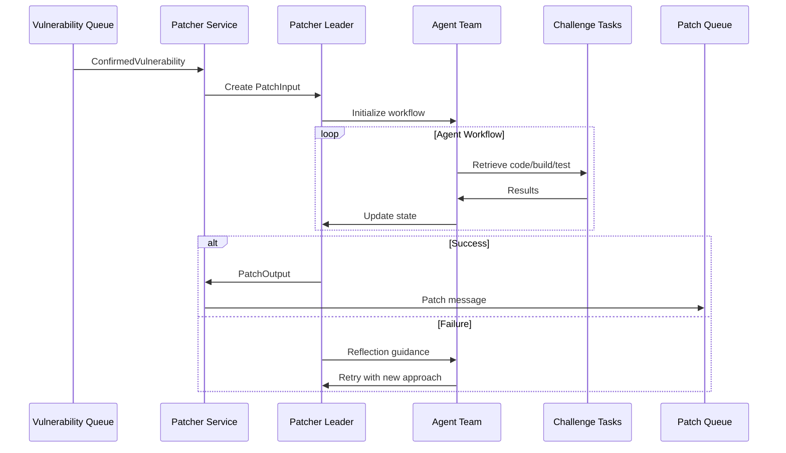

# Buttercup Patcher


## Overview

The Buttercup Patcher is an autonomous AI-powered vulnerability patching system that automatically generates, tests, and validates security patches for software vulnerabilities. It uses a multi-agent architecture with specialized LLM agents working together to analyze vulnerabilities, create patches, and ensure they are effective and safe.

## Architecture

The patcher system consists of several key components:

### Core Components

1. **Patcher Service** - Main orchestrator that processes vulnerability reports from queues
2. **Patcher Leader Agent** - Coordinates the multi-agent workflow
3. **Specialized Agents** - Each handling specific aspects of the patching process
4. **State Management** - Tracks progress and maintains context across the workflow
5. **Queue System** - Handles incoming vulnerability reports and outgoing patches



## Agent Workflow

The patcher uses a sophisticated multi-agent workflow where each agent has a specific role:



## Detailed State Machine

The patcher uses a complex state machine to manage the patching process:



## Agent Details

### 1. Input Processing Agent
- Processes incoming vulnerability reports
- Extracts key information (task ID, PoV data, stack traces)
- Prepares initial context for analysis

### 2. Context Retriever Agent
- Uses program model to find relevant code snippets
- Searches for test files and harness code
- Retrieves additional context as needed during analysis

### 3. Root Cause Analysis Agent
- Analyzes vulnerability stack traces and diffs
- Identifies the fundamental security issue
- Determines affected code paths and data flows
- Can request additional code snippets for deeper analysis

### 4. Patch Strategy Agent
- Develops high-level approach to fix the vulnerability
- Plans security mechanisms and validation steps
- Defines scope of changes needed
- Does not generate code, only strategy

### 5. Software Engineer Agent
- Generates actual code patches based on strategy
- Creates diff files in standard format
- Ensures patches are minimal and targeted
- Handles multiple file modifications

### 6. Quality Engineer Agent
- Builds and tests generated patches
- Runs PoV (Proof of Vulnerability) tests
- Executes existing test suites
- Validates patch doesn't modify harness code
- Checks language consistency

### 7. Reflection Agent
- Analyzes failures and determines next steps
- Prevents infinite loops through retry limits
- Provides guidance to other agents
- Makes decisions about when to retry vs. terminate

## Data Flow



## Key Features

### 1. Multi-Agent Collaboration
- Specialized agents for different aspects of patching
- Coordinated workflow with state management
- Intelligent routing based on failure analysis

### 2. Robust Error Handling
- Comprehensive retry logic with limits
- Failure categorization and analysis
- Prevention of infinite loops

### 3. Code Quality Assurance
- Build validation across multiple sanitizers
- PoV testing to ensure vulnerability is fixed
- Test suite execution to prevent regressions
- Harness code protection

### 4. Context-Aware Analysis
- Dynamic code snippet retrieval
- Program model integration for code understanding
- Stack trace analysis and mapping

### 5. Scalable Architecture
- Queue-based processing
- Parallel build and test execution
- Configurable retry limits and timeouts

## Configuration

The patcher can be configured through environment variables and configuration files:

- `max_patch_retries`: Maximum number of patch attempts (default: 10)
- `max_root_cause_analysis_retries`: Root cause analysis retries (default: 3)
- `max_patch_strategy_retries`: Strategy development retries (default: 3)
- `max_tests_retries`: Test execution retries (default: 5)
- `max_minutes_run_povs`: PoV execution timeout (default: 30 minutes)
- `max_concurrency`: Parallel execution limit (default: 5)

## Usage

The patcher can be run in several modes:

1. **Service Mode**: Continuously processes vulnerabilities from queues
2. **Single Task Mode**: Processes a specific vulnerability
3. **Message Mode**: Processes a specific vulnerability message

```bash
# Service mode
buttercup-patcher serve --redis-url redis://localhost:6379

# Single task mode
buttercup-patcher process --task-id TASK123 --internal-patch-id PATCH456

# Message mode
buttercup-patcher process-msg --msg-path vulnerability.msg
```

## Integration

The patcher integrates with:

- **Redis**: For queue management and task coordination
- **Program Model**: For code understanding and snippet retrieval
- **Challenge Tasks**: For building and testing patches
- **Telemetry**: For monitoring and observability
- **Task Registry**: For task lifecycle management

This architecture enables the patcher to autonomously handle complex vulnerability patching tasks while maintaining high quality and reliability standards.
# Trigger CI test run
