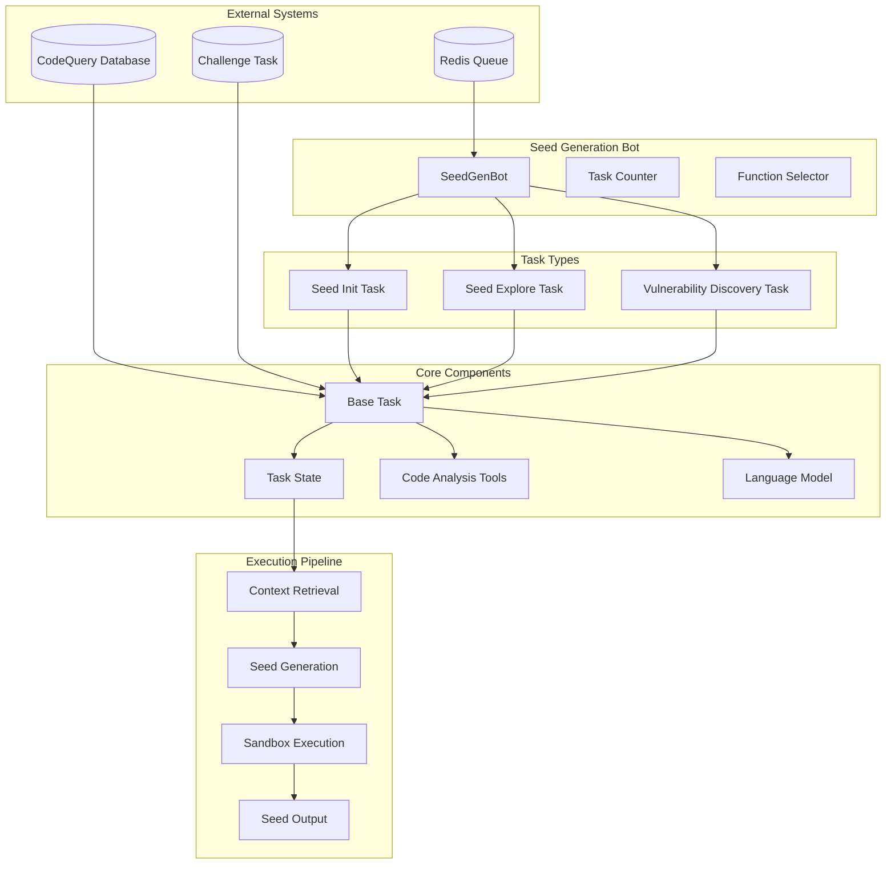
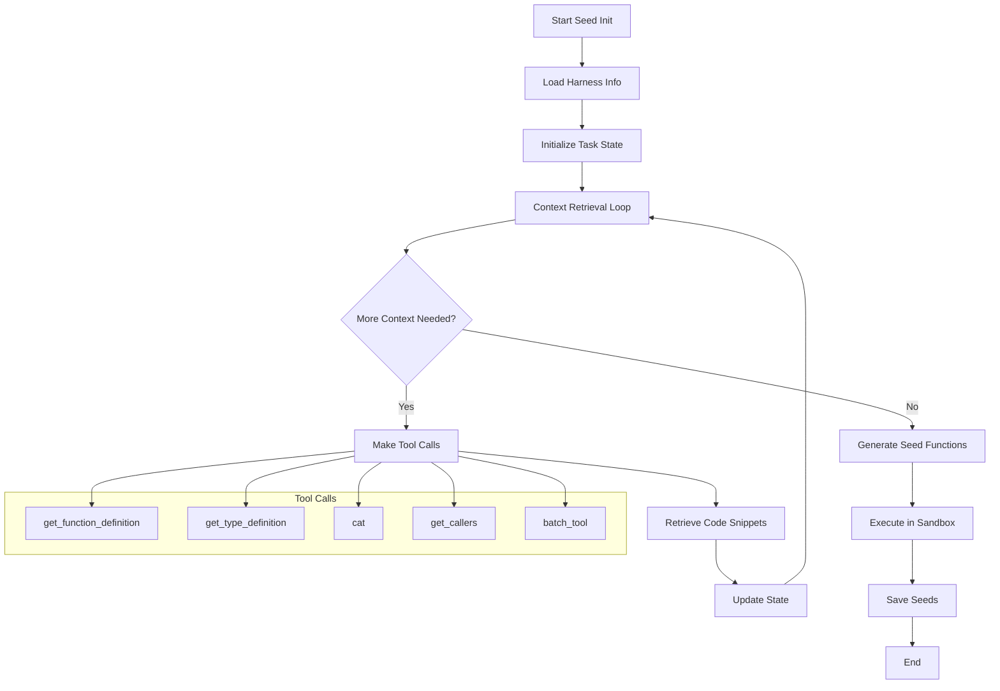
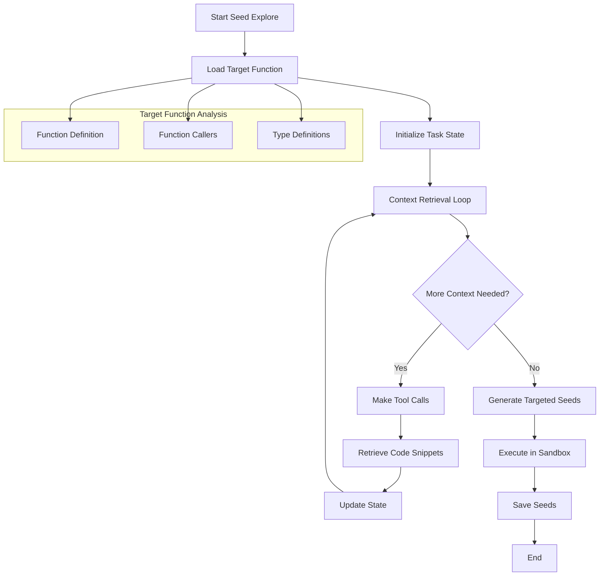
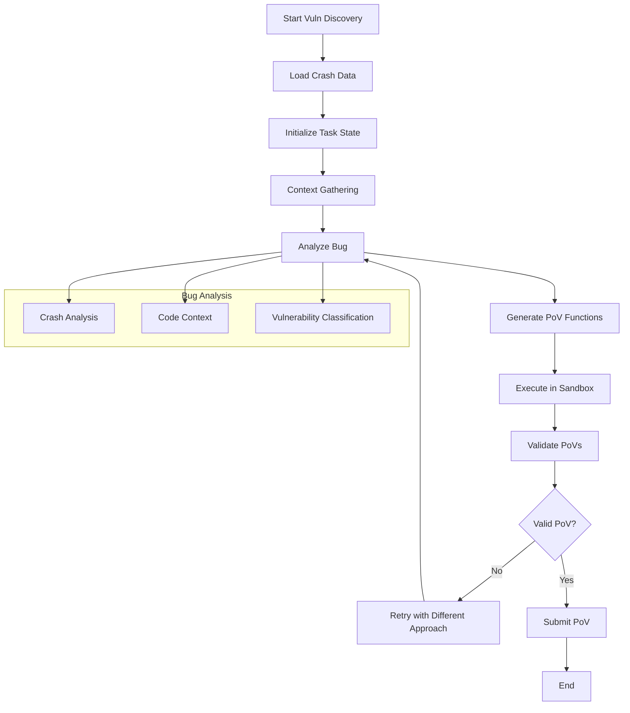
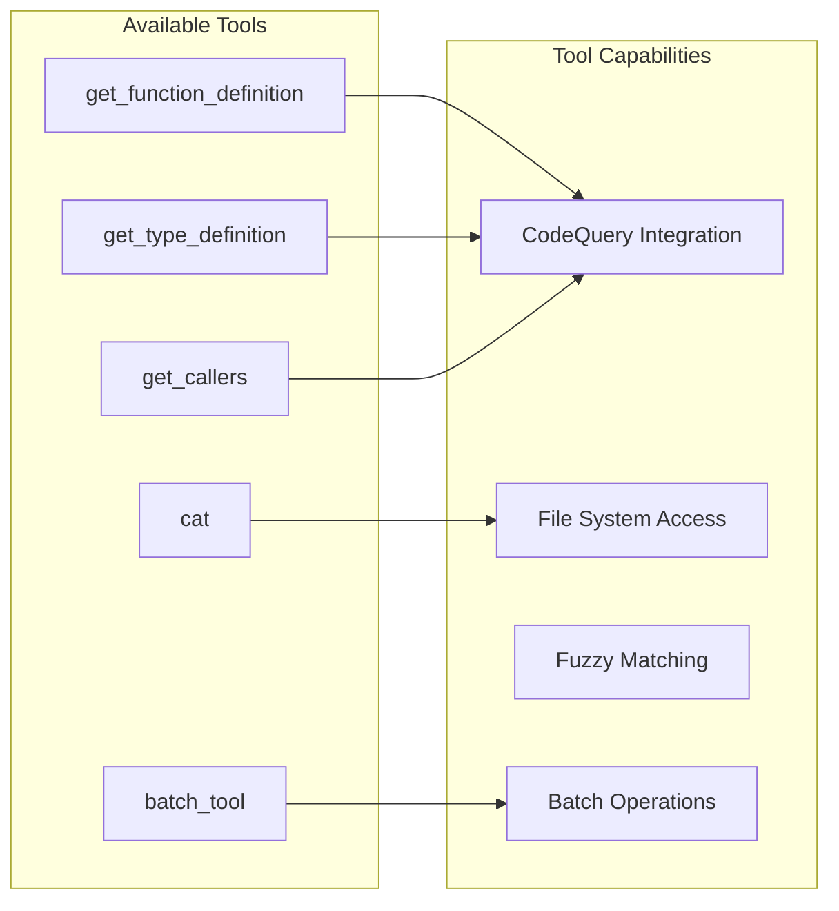
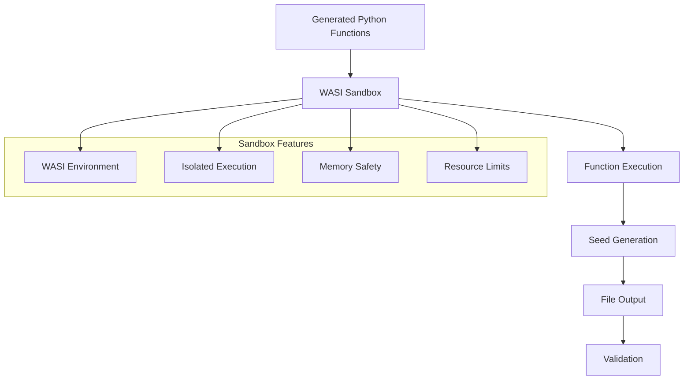

# Buttercup Seed Generation (seed-gen)

The `seed-gen` module is a sophisticated LLM-powered system for generating seed inputs for fuzzing campaigns. It uses large language models to analyze codebases and generate high-quality seed inputs that bootstrap fuzzing corpora.

## Overview

The seed generation system operates in three main modes:

1. **Seed Initialization (seed-init)**: Creates initial seed inputs to bootstrap a fuzzing corpus
2. **Seed Exploration (seed-explore)**: Generates targeted seeds for specific functions
3. **Vulnerability Discovery (vuln-discovery)**: Analyzes crashes and generates proof-of-vulnerability (PoV) inputs

## Architecture



## Task Workflow

### Seed Initialization Workflow



### Seed Exploration Workflow



### Vulnerability Discovery Workflow



## Key Components

### 1. SeedGenBot
The main orchestrator that:
- Manages task scheduling and prioritization
- Handles Redis queue communication
- Implements task probability distributions
- Ensures minimum task execution counts

### 2. Task System
Base task infrastructure providing:
- LLM integration with fallback models
- Code analysis tools (function definitions, type definitions, file reading)
- Context retrieval and state management
- Sandbox execution environment

### 3. Code Analysis Tools


### 4. Sandbox Execution


## Task Probability Distribution

The system uses different probability distributions based on whether the challenge is in full or delta mode:

### Full Mode
- **Seed Init**: 5%
- **Vulnerability Discovery**: 35%
- **Seed Explore**: 60%

### Delta Mode
- **Seed Init**: 5%
- **Vulnerability Discovery**: 45%
- **Seed Explore**: 50%

## Configuration

The system is configured through environment variables and command-line arguments:

```yaml
# Server Configuration
redis_url: "redis://127.0.0.1:6379"
corpus_root: "/path/to/corpus"
sleep_time: 5
max_corpus_seed_size: 65536  # 64 KiB
max_pov_size: 2097152        # 2 MiB
crash_dir_count_limit: null

# Task Configuration
challenge_task_dir: "/path/to/task"
harness_name: "target_harness"
package_name: "target_package"
task_type: "seed-init|seed-explore|vuln-discovery"
```

## Usage

### Server Mode
```bash
seed-gen server --redis-url redis://localhost:6379 --corpus-root /path/to/corpus
```

### Process Mode
```bash
seed-gen process \
  --challenge-task-dir /path/to/task \
  --harness-name target_harness \
  --package-name target_package \
  --task-type seed-init \
  --output-dir /path/to/output
```

## Integration Points

The seed-gen module integrates with several other Buttercup components:

- **Common**: Challenge task management, corpus handling, telemetry
- **Program Model**: Code query capabilities for function and type analysis
- **Fuzzer**: Generated seeds are used to bootstrap fuzzing campaigns
- **Orchestrator**: Task scheduling and coordination

## Security Considerations

1. **Sandboxed Execution**: All generated code runs in a WASI sandbox
2. **Resource Limits**: Maximum seed and PoV sizes are enforced
3. **Input Validation**: Generated functions are validated before execution
4. **Isolation**: Each task runs in its own temporary directory

## Monitoring and Telemetry

The system provides comprehensive monitoring through:
- Langfuse callbacks for LLM interaction tracking
- OpenTelemetry spans for performance monitoring
- Structured logging for debugging and analysis
- Task counters for execution statistics
